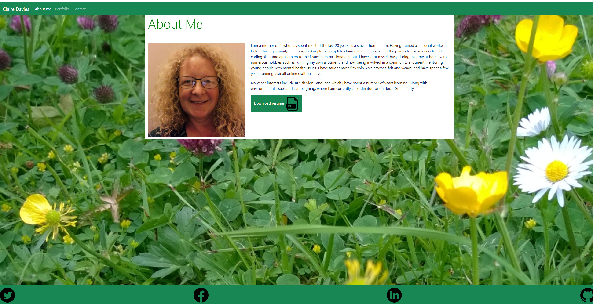
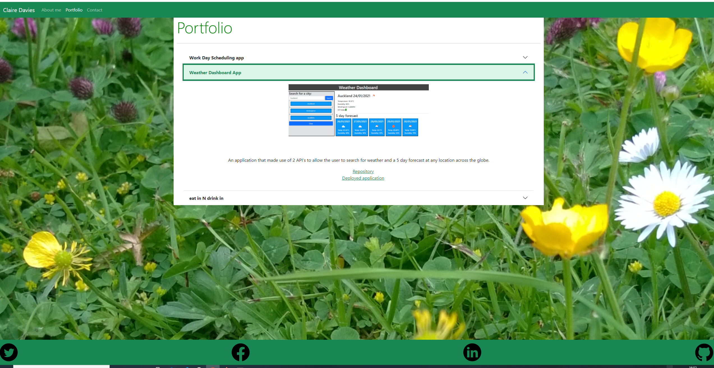

# Responsive Portfolio  

## Explanation of the Portfolio  
Creating a three page website with pages giving some background information about myself, contact details along with a resume download button and a portfolio page detailing some recent work.  This gives a central location to bring together all aspects of my development as a full stack developer, and includes links to GitHub and LinkedIn 

## Live link to the deployed portfolio  

The live site is found at [GithubPages]: (https://clairemdavies.github.io/portfolio/)  

## Screenshots of the portfolio  

Screenshots of the pages follow below:  
 
  
  

  

## Technologies used  
- HTML
- CSS
- Bootstrap CSS library

## License  
MIT

## Contact information
Claire Davies: [Github](https://github.com/ClaireMDavies)  