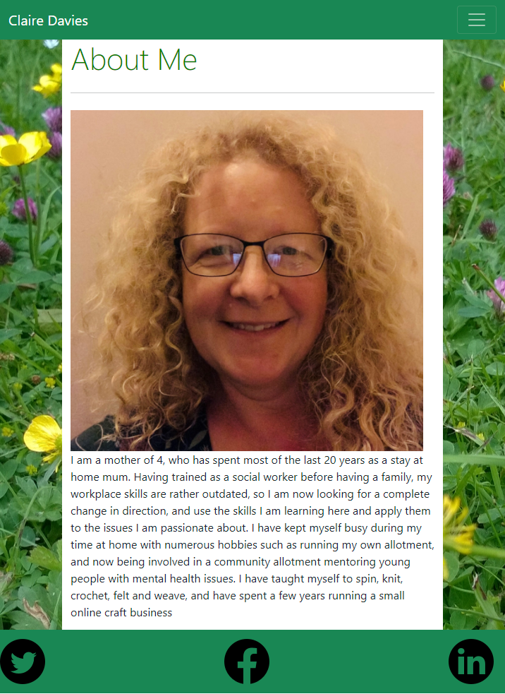
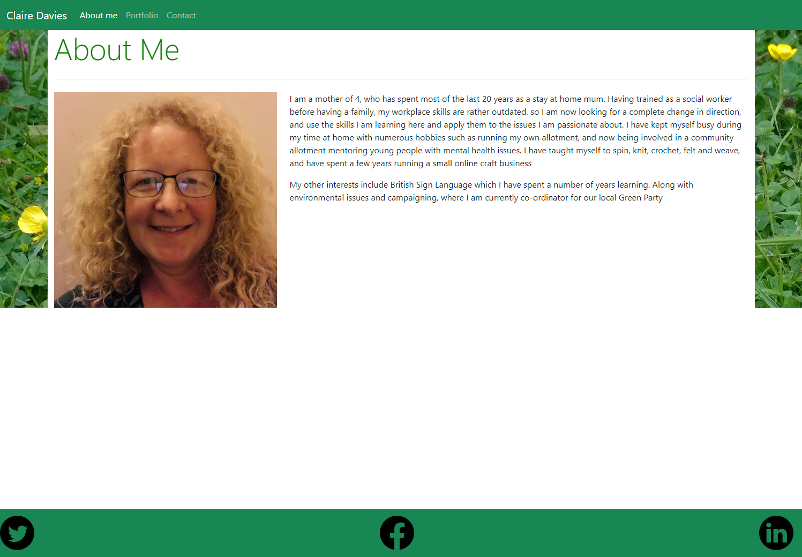
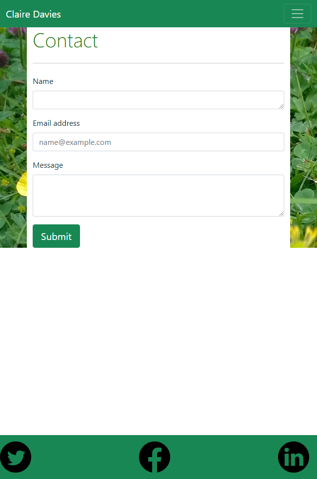
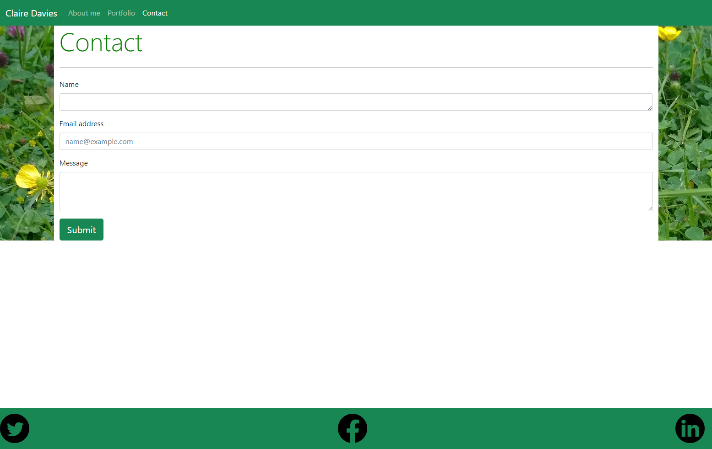
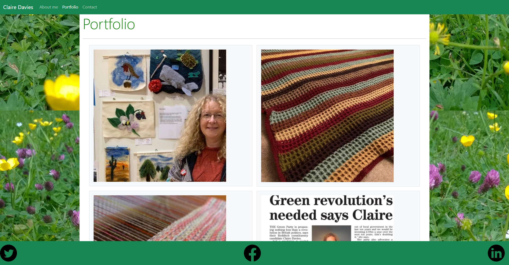

# week-03-responsive-portfolio-homework  

## Aim of the homework  
To create a three page website with pages giving information about yourself, a form for people to contact you, and a portfolio page to showcase work you have done.   

This was a very steep learning curve, with a lot of googling, experimenting, and general tinkering.  

## Functions across all pages
To start with I created the three html files and linked them together using the navbar in Bootstrap.  There were functions on it that I did not require, such as the search bar, so I removed those. The next challenge was to work out how to get the "burger icon" to work, so that the menu became a collapsible menu bar once the screen size reached small.  So Javascript links were added at the bottom of the html body on each page to create functionality.  

Using a Jumbotron feature for some of the styling, but again there were elements that I did not require, such as buttons, so I removed them.

I decided I wanted a picture behind the container on each page.  I was therefore able to add one of my own pictures to the assets folder, and link to it.  Getting the image to scale with the container size was achieved with giving it 100% height in the css file.  

I used a nav bar again at the bottom of the page, with a "fixed bottom" feature.  To this I was able to add my social media links, by adding icon images to the assets folder, and linking those images to my social media links.  

At each part of the creation of the pages, when new features were added, I would push the pages to GitHub.  

Once the pages were completed, I ran them through the html checker at validator.w3.org, where I found a few missing brackets, and few errors that came about through the copying and pasting from Bootstrap, where I was unsure of the function of some of the code, and needed to amend it to make it less generic. 

## Index.html page  
Adding an image to the page was the first hurdle, learning how to resize the image give a width to the image so that it was an appropriate size.   

I then wanted the text to wrap around the image slightly, and to move below the image when the screen size became small.  Defining the screen sizes using the bootstrap predefined sizes definitely made it easier.   

## Contact page  
There was a bootstrap example that was very close to what I required, so used that, and added an extra element within it to allow a name to be added.   

I am aware that there is currently no functionality to the page, but am hoping that we will cover this at a later date.   

## Portfolio page  
I found this particularly frustrating because I could not get the page to be responsive AND a have a decent layout.  This took alot of time to figure out having looked at gutters, grids, and many more things inbetween!  I finally found the exact thing I required as an example on Bootstrap, and once that was found, it was straightforward to fill the portfolio with images, in a fashion that was responsive.  

I realise that the images I have filled it with are not computer related, but as this is the start of my journey they currently represent what I have done up to this point, I will be relacing those images with examples of my work as I produce it.   

## The finished work  

The live site is found at [GithubPages]: (https://clairemdavies.github.io/week-03-responsive-portfolio-homework/)  

Screenshots of the pages both in their small form and larger form follow below:  
 
  
  
  
  
  