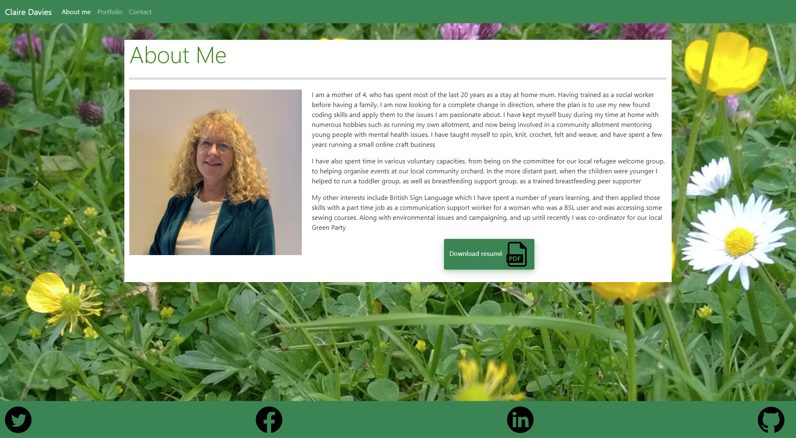
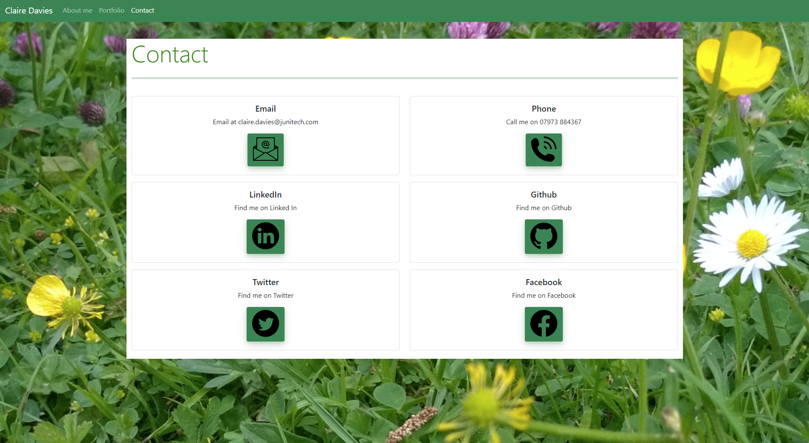

# Responsive Portfolio 

## Description
Creating a three page website with pages giving some background information about myself, contact details along with a resume download button and a portfolio page detailing some recent work.  This gives a central location to bring together all aspects of my development as a full stack developer, and includes links to GitHub and LinkedIn

## Table of Contents
  - [Responsive Portfolio](#responsive-portfolio)
  - [Description](##description)
  - [Table of Contents](##table-of-contents)
  - [Deployed Portfolio](##deployed-portfolio)
  - [Screenshots](##screenshots)
  - [License](##license)
  - [Technologies Used](##technologies-used)
  - [Contact Information](##contact-information)

## Deployed Portfolio 

The live site is found at [GithubPages](https://clairemdavies.github.io/portfolio/) 

## Screenshots

Screenshots of the pages follow below: 

 

 

  
## License 
Licensed under the [MIT License](LICENSE).

## Technologies used 
- HTML
- CSS
- Bootstrap CSS library

## Contact information
Claire Davies:  

- [Github](https://github.com/ClaireMDavies) 
- [Email](mailto:claire.davies@junitech.com)